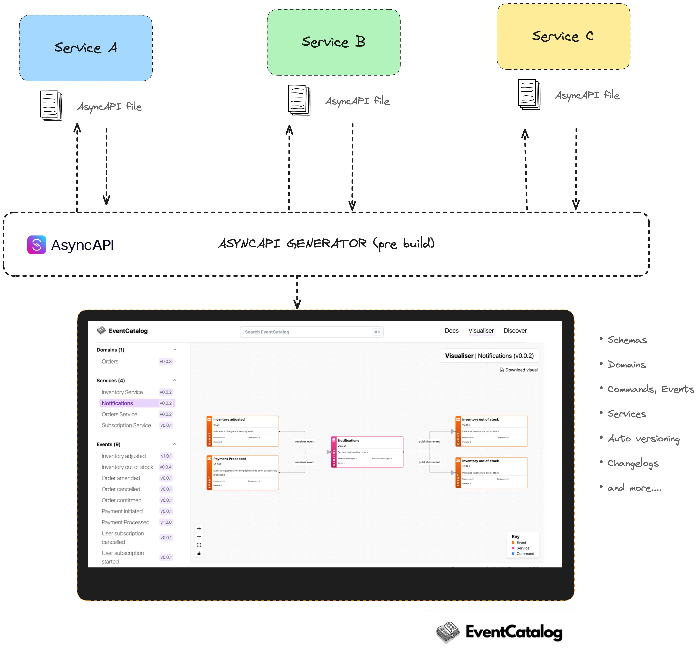

<div align="center">

<h1>⚡️ AsyncAPI generator for EventCatalog</h1>

[![PRs Welcome][prs-badge]][prs]

[](https://discord.gg/3rjaZMmrAm) [](https://www.linkedin.com/in/david-boyne/) [](https://eda-visuals.boyney.io/?utm_source=event-catalog-gihub) [](https://github.com/event-catalog/generator-asyncapi/blob/main/LICENSE.md)



<h4>Features: Generate EventCatalogs with your AsyncAPI files, Auto versioning, schema downloads, map to domains, custom AsyncAPI extensions and more... </h4>

[Read the Docs](https://eventcatalog.dev/) | [Edit the Docs](https://github.com/event-catalog/docs) | [View Demo](https://demo.eventcatalog.dev/docs)

</div>

<hr/>

# Core Features

- 📃 Document domains, services and messages from your AsyncAPI file ([example](https://github.com/event-catalog/eventcatalog-asyncapi-example))
- 📊 Visualise your architecture ([demo](https://demo.eventcatalog.dev/visualiser))
- ⭐ Download your AsyncAPI files and message schemas form EventCatalog (e.g Avro, JSON) ([demo](https://demo.eventcatalog.dev/docs/events/InventoryAdjusted/0.0.4))
- 💅 Custom MDX components ([read more](https://eventcatalog.dev/docs/development/components/using-components))
- 🗄️ Auto versioning of your domains, services and messages
- ⭐ Discoverability feature (search, filter and more) ([demo](https://demo.eventcatalog.dev/discover/events))
- ⭐ And much more...

# How it works

[EventCatalog](https://www.eventcatalog.dev/) is technology agnostic, meaning it can integrate with any schemas, specs or brokers.

EventCatalog supports [generators](https://www.eventcatalog.dev/docs/development/plugins/generators).
Generators are scripts are run to pre build to generate content in your catalog. Generators can use the [EventCatalog SDK](https://www.eventcatalog.dev/docs/sdk).

With this AsyncAPI plugin you can connect your AsyncAPI files to your catalog. This is done by defining your generators in your `eventcatlaog.config.js` file.

```js
...
generators: [
    [
      '@eventcatalog/generator-asyncapi',
      {
        services: [
          { path: path.join(__dirname, 'asyncapi-files', 'orders-service.asyncapi.yml'), id: 'Orders Service'},
          { path: path.join(__dirname, 'asyncapi-files', 'accounts-service.asyncapi.yml'), id: 'Accounts Service', name: 'Awesome Accounts Service')},
          // Fetch AsyncAPI file from an external URL
          { path: "https://raw.githubusercontent.com/event-catalog/generator-asyncapi/refs/heads/main/src/test/asyncapi-files/simple.asyncapi.yml", id: 'Payment Service', name: 'Payment Service')}
        ],
        domain: { id: 'orders', name: 'Orders', version: '0.0.1' },
      },
    ],
  ],
...
```

In this example the generator will read the `orders-service.asyncapi.yml` file and also fetch AsyncAPI files from an external URL and populate services and messages inside your catalog. It will add the services to the domain `Orders`.

You can see an example in the [eventcatalog-asyncapi-example](https://github.com/event-catalog/eventcatalog-asyncapi-example/blob/main/eventcatalog.config.js) repo

# Getting started

## Installation and configuration

_Make sure you are on the latest version of EventCatalog_.

1. Install the package

```sh
@eventcatalog/generator-asyncapi
```

2. Configure your `eventcatalog.config.js` file [(see example)](https://github.com/event-catalog/eventcatalog-asyncapi-example/blob/main/eventcatalog.config.js)

3. Run the generate command

```sh
npm run generate
```

4. See your new domains, services and messages, run

```sh
npm run dev
```

## Found a problem?

Raise a GitHub issue on this project, or contact us on [our Discord server](https://discord.gg/3rjaZMmrAm).

# Sponsors

Thank you to our project sponsors.

## Gold sponsors

<div align="center">
  
  <p style="margin: 0; padding: 0;">Serverless infrastructure for event-driven architecture. </p>
  <a href="https://hookdeck.com/?ref=eventcatalog-sponsor" target="_blank" >Learn more</a>
</div>

<hr />

<div align="center">
  
  <p style="margin: 0; padding: 0;">Manage, secure, and govern every API in your organization</p>
  <a href="https://gravitee.io?utm_source=eventcatalog&utm_medium=web&utm_campaign=sponsorship" target="_blank" >Learn more</a>
</div>

<hr />

_Sponsors help make EventCatalog sustainable, want to help the project? Get in touch! Or [visit our sponsor page](https://www.eventcatalog.dev/support)._

# Enterprise support

Interested in collaborating with us? Our offerings include dedicated support, priority assistance, feature development, custom integrations, and more.

Find more details on our [services page](https://eventcatalog.dev/services).

# Contributing

If you have any questions, features or issues please raise any issue or pull requests you like. We will try my best to get back to you.

You can find the [contributing guidelines here](https://eventcatalog.dev/docs/contributing/overview).

## Running the project locally

1. Clone the repo
1. Install required dependencies `pnpm i`
1. Run the examples `npx tsx examples/streelights-mqtt/index.ts
1. Run tests `pnpm run tests`

[license-badge]: https://img.shields.io/github/license/event-catalog/eventcatalog.svg?color=yellow
[license]: https://github.com/event-catalog/eventcatalog/blob/main/LICENSE
[prs-badge]: https://img.shields.io/badge/PRs-welcome-brightgreen.svg?style=flat-square
[prs]: http://makeapullrequest.com
[github-watch-badge]: https://img.shields.io/github/watchers/event-catalog/eventcatalog.svg?style=social
[github-watch]: https://github.com/event-catalog/eventcatalog/watchers
[github-star-badge]: https://img.shields.io/github/stars/event-catalog/eventcatalog.svg?style=social
[github-star]: https://github.com/event-catalog/eventcatalog/stargazers

# Commercial Use

This project is governed by a [dual-license](./LICENSE.md). To ensure the sustainability of the project, you can freely make use of this software if your projects are Open Source. Otherwise for proprietary systems you must obtain a [commercial license](./LICENSE-COMMERCIAL.md).

To obtain a commercial license or have any questions you can email us at `hello@eventcatalog.dev`
